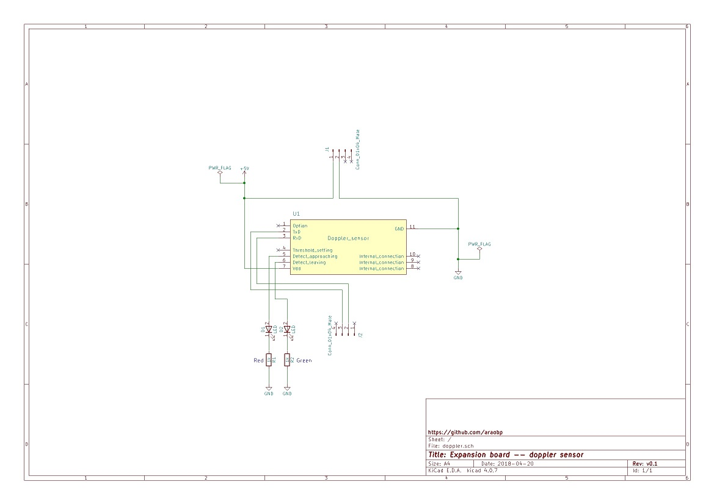

# Expansion boards

## Board layout

Six pins are connected to 14pin PIC16F1 DIP.

```
 5V GND RA5 RA4
 o   o   o   o
 .   .   .   .
 .   .   .   .
 .   .   .   .
 .   .   .   .
 .   .   .   .
 .   .   .   .
 o   o   o   o
 RA3 RC5 RC4 RC3
```

## Thermistor

### Circuit


### BOM

|Part                      |Akizuki-denshi URL |Price in Yen |Quantity|
|--------------------------|-------------------|-------------|--------|
|Thermistor  |http://akizukidenshi.com/catalog/g/gP-07258/|50|1|
|Register 10k ohm          |http://akizukidenshi.com/catalog/g/gR-25103/|1|1|
|Pin header 4pins          |http://akizukidenshi.com/catalog/g/gC-00167/|-|2|

## Doppler sensor

### Circuit



## Luninosity sensor

## Wall light

## Small camera
