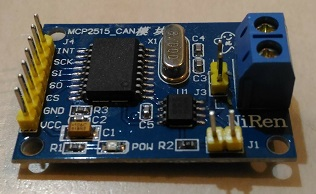
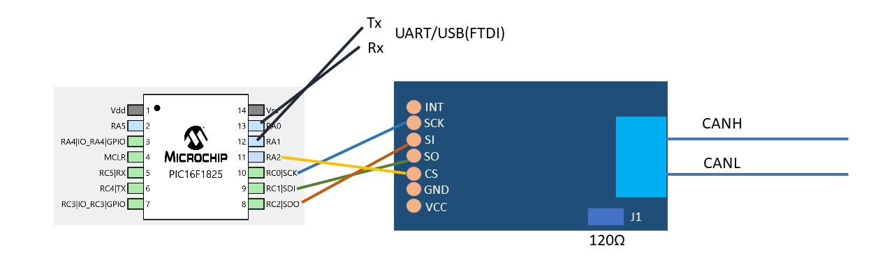
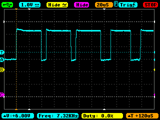
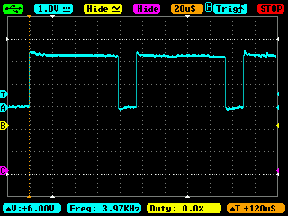
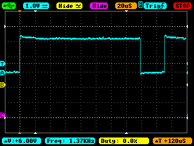
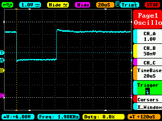
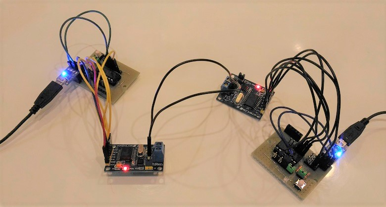
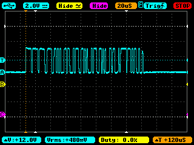

# CAN adaptor to UART (PIC16F1825)


## Current status

Version 0.1: March 17, 2018

## Motivation

I evaluated CAN on mbed LPC1768 boards with CAN tranceivers(MCP2561), but LPC1768 is expensive for IoT prototyping.

I have ever used Microchip PIC1825 MCU for IoT prototyping a lot of times since 2016. Altough the MCU's functionality is very limited, it is very cheap and satisify most of requirements as MCU for IoT prototyping.

I want to try out the combination of PIC16F1825 and CAN controller(MCP2515)/tranceiver(MCP2551 or MCP2561) this time.



## Configuration

```
                                          ---+------+-----+--- CAN bus
                                             |      |     |
[PC]-USB/UART-[PIC16F1825]-SPI-[MCP2515]-[TJA1050]| | [TJA1050]-[MCP2515]-SPI-[PIC16F1825]-USB/UART-[PC]
                                                    |
                                                [TJA1050]-[MCP2515]-SPI-[PIC16F1825]-USB/UART-[PC]                                                    
```

## My original PIC16F1
825 evaluation board


## Wiring with jumper cables



## Development enviroment

Microchip [MPLAB-X IDE](http://www.microchip.com/mplab/mplab-x-ide) with MCC plugin.

## Command (UART/USB)

```
/// UART2CAN HELP (version 0.1  March 17, 2018) ///
[Set standard identifier] @i<standard identifier>
[Set output mode] {debug: @vd, verbose: @vv, normal: @vn}
[Enable operation mode] {loopback: @ol, normal: @on}
     with SID: @ols or @ons, in hex format: @olh or @onh
[Set mask] @m<n><mask(SID10 ~ SID0)>
[Set filter] @f<n><filter(SID10 ~ SID0)>
[Set baud rate] @b<bpr>
[Abort all pending transmissions] @a
[Dump registers] @d
[Send message] <message>
[Send message beginning with '@' character] @<@message>
[Receive message] <message> will be output
[Show this help]: @h
```

## Mask and filters

For example, to receive messages with SID 5, 10 and 15:
```
@m02047  --> RXM0 0b11111111111
@f05     --> RXF0 0b00000000101 (SID 5 message to RXB0)
@f110    --> RXF1 0b00000001010 (SID 10 message to RXB0)
@m12047  --> RXM1 0b11111111111
@f215    --> RXF2 0b00000001111 (SID 15 message to RXB1)
```

## Baud rate test on March 17th, 2018

### BPR2 (16TQ = 8 micro sec, 125kHz)



### BPR4 (16TQ = 16 micro sec, 62.5kHz)



### BPR8 (16TQ = 32 micro sec, 31.3kHz)



### BPR16 (16TQ = 64 micro sec, 15.6kHz)



## 1st test on March 14th, 2018

(The problem below has already been fixed in ver 0.1 release)





It seemed like I forgot to set CNF1, CNF2 and CNF3 to appropriate values to generate 125kbps baudrate.

Assuming that the oscillator runs at 8MHz and BRP(Buad Rate Prescaller) = 2,

```
TQ = 2*2/8MHz = 500ns  ... Equation 5-2 in P38
16TQ corresponds to 125kHz

According to 5.3 in P 41,
SyncSeg = 1 TQ,
PropSeg = 2 TQ,
PS1 = 7TQ,
PS2 = 6TQ.

Total 16TQ.

CNF1 in P42
SJW: 01
BRP: 000001

CNF2
BTLMODE: 1
SAM: 1
PHSEG1: 110
PRSEG: 001

CNF3
SOF: 0
WAKFIL: 0
PHSEG2: 101
```

So the values of CNF1, CNF2 and CNF3 would be like this:

|Register | Value  |
|---------|--------|
|CNF1(2Ah)|01000001|
|CNF2(29h)|11110001|
|CNF3(28h)|00000101|

## Datasheet (Microchip/NXP)

- [PIC16F1825](http://ww1.microchip.com/downloads/en/DeviceDoc/41440A.pdf)
- [MCP2515](http://ww1.microchip.com/downloads/en/DeviceDoc/21801d.pdf)
- [MCP2551](http://ww1.microchip.com/downloads/en/DeviceDoc/21667E.pdf)
- [MCP2561](http://ww1.microchip.com/downloads/en/DeviceDoc/20005167C.pdf)
- [TJA1050](https://www.nxp.com/docs/en/data-sheet/TJA1050.pdf)
