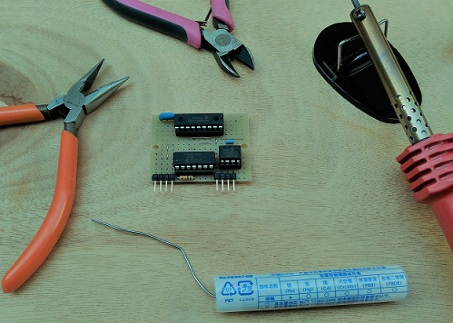

# CAN adapter to UART


## Motivation

I want to connect PIC-MCU-based sensor/actuator blocks to home/office controller(RasPi or OpenWrt) over CAN, since CAN is very cheap and supports daisy-chain network topology.

## Specification

|Parameter     |Value                       |
|--------------|----------------------------|
|UART baud rate|9600 bps (fixed)            |
|SPI clock     |500kHz (fixed)              |
|CAN speed     |Max. 250kHz (default 125kHz)|

## Current status and plan

### Version 0.1 (March 17, 2018)


- Purchased CAN adaptors from Amazon.
- Evaluate CAN ==> [EVALUATION](./doc/EVALUATION.md).
- Developed my original ASCII-based protocol over serial for MCP2515. The protocol is mainly for evaluating MCP2515.

### Version 0.2 plan

- Purchase three pairs of MCP2515 and MCP2561 in Akihabara.
- Develop my original CAN adaptor board.
- Develop CAN-MQTT gateway on RasPi and OpenWrt.
- Develop a 3D-printed DIN rail enclosure for the board by using [FreeCAD](https://www.freecadweb.org/).
- ~~Add [SLCAN](https://elixir.bootlin.com/linux/v3.4/source/drivers/net/can/slcan.c) that is ASCII-based protocol for SocketCAN.~~

### Version 0.3 plan

- Purchase [a cheap ARM mbed board](http://akizukidenshi.com/catalog/g/gK-12144/).
- Develop CAN-MQTT gateway on mbed.

### Version 0.4 plan

- Use KiCAD to redesign the circuit.

## CAN adaptor to UART

### With PC/Android(USB-OTG)

```
[PC or Android]-USB-[FTDI]-UART-[PIC16F1825]-SPI-[MCP2515]-[TJA1050]-- CAN bus

```
### With MCU (PIC, AVR or ARM Cortex-M)

```
[MCU]-UART-[PIC16F1825]-SPI-[MCP2515]-[TJA1050]-- CAN bus
```

### Use it as CAN library for PIC MCU

```
[PIC16F1XXX]-SPI-[MCP2515]-[TJA1050]-- CAN bus                   
```

## Development environment

Microchip [MPLAB-X IDE](http://www.microchip.com/mplab/mplab-x-ide) with MCC plugin.

## Command (UART/USB)

```
/// UART2CAN HELP (version 0.11  March 19, 2018) ///
[Set standard identifier] @i<standard identifier>
[Set output mode] {debug: @vd, verbose: @vv, normal: @vn}
[Enable operation mode] {loopback: @ol, normal: @on}
     with SID: @ols or @ons, in hex format: @olh or @onh
[Set mask] @m<n><mask(SID10 ~ SID0)>
[Set filter] @f<n><filter(SID10 ~ SID0)>
[Set baud rate] @b<bpr>
[Abort all pending transmissions] @a
[Dump masks and filters] @F
[Dump registers] @D
[Send message] <message>
[Send message beginning with '@' character] @<@message>
[Receive message] <message> will be output
[Show this help]: @h
```

## Mask and filters

For example, to receive messages with SID 5, 10 and 15:
```
@m02047  --> RXM0 0b11111111111
@f05     --> RXF0 0b00000000101 (SID 5 message to RXB0)
@f110    --> RXF1 0b00000001010 (SID 10 message to RXB0)
@m12047  --> RXM1 0b11111111111
@f215    --> RXF2 0b00000001111 (SID 15 message to RXB1)
```
## CAN adaptor board

At first, I am going to use [this universal board](http://akizukidenshi.com/catalog/g/gP-08241/) to make a prototype of the CAN adaptor:


I have finished the first prototype (Marth 25, 2018):



After that, I am going to try [KiCAD](http://kicad-pcb.org/) to make my original board.

## Reference

### Datasheet (Microchip/NXP/Murata)

#### Microchip
- [PIC16F1825](http://ww1.microchip.com/downloads/en/DeviceDoc/41440A.pdf)
- [MCP2515](http://ww1.microchip.com/downloads/en/DeviceDoc/21801d.pdf)
- [MCP2561](http://ww1.microchip.com/downloads/en/DeviceDoc/20005167C.pdf)
- [MCP2515DM-BM](http://www.microchip.com/Developmenttools/ProductDetails.aspx?PartNO=MCP2515DM-BM)

#### NXP
- [TJA1050](https://www.nxp.com/docs/en/data-sheet/TJA1050.pdf)

#### Murata
- [Ceralock](https://www.murata.com/~/media/webrenewal/support/library/catalog/products/timingdevice/ceralock/p17e.ashx)
