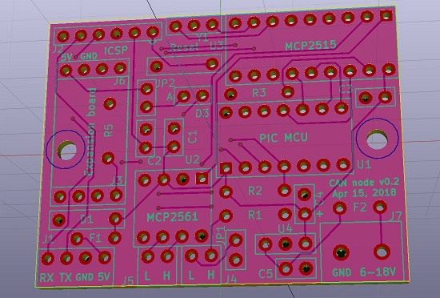
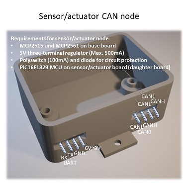
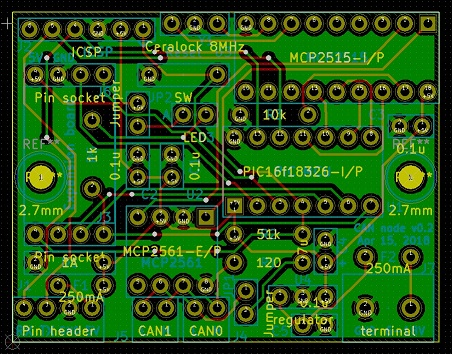

# IoT with CAN bus



Printed circuit design for CAN node

## Motivation

I want to develop very cheap and low power sensor/actuator node with CAN bus.

## Architecture

### Basic concept

I pursue seamless communications between CAN-bus and MQTT-bus:


## CAN node base board specification

|Parameter           |Value                       |Note
|--------------------|----------------------------|---------------------------|
|PIC16F1 MCU clock   |32MHz(Internal OSC 8MHz * 4 PLL)                        |
|UART baud rate      |9600bps (fixed)             |Full-duplex wire-rate is not supported|
|SPI clock           |2MHz (fixed)                |                           |
|CAN speed           |Max. 250kHz (default 125kHz)|                           |
|Oscillator for CAN controller|8MHz (ceramic)     |Murata Ceralock            |
|Expansion board     |8 pins connected to PIC MCU |                           |

## Parts

Approximately, the total cost is 500 yen ( < five dollors) per board.

|Part                      |Akizuki-denshi URL |Price in Yen |Quantity|
|--------------------------|-------------------|-------------|--------|
|Microchip PIC16F1825-I/P  |http://akizukidenshi.com/catalog/g/gI-10656/|150|1|
|Microchip PIC16F18326-I/P |http://akizukidenshi.com/catalog/g/gI-11886/|130|1|
|Microchip MCP2515         |http://akizukidenshi.com/catalog/g/gI-12030/|160|1|
|Microchip MCP2561         |http://akizukidenshi.com/catalog/g/gI-12483/|90|1|
|Murata Ceralock 8MHz      |http://akizukidenshi.com/catalog/g/gP-00153/|35|1|
|Regiter 51k ohm           |http://akizukidenshi.com/catalog/g/gR-25513/|1|1|
|Register 10k ohm          |http://akizukidenshi.com/catalog/g/gR-25103/|1|1|
|Register 120 ohm          |http://akizukidenshi.com/catalog/g/gR-25121/|1|1|
|Murata capacitor 0.1 micro F|http://akizukidenshi.com/catalog/g/gP-00090/|10|3|
|IC sockets 14pins         |                                            |10|1|
|IC sockets 18pins         |                                            |10|1|
|IC sockets 8pins          |                                            |10|1|
|Pin header                |                                            |  | |

## Software development environment

Microchip [MPLAB-X IDE](http://www.microchip.com/mplab/mplab-x-ide) with MCC plugin.

## Standard Identifier format

This implementation supports CAN Standard Frame only (does not support Extended Frame). For home networking, 11bit Standard Identifier suffices.

=> [FORMAT](./doc/FORMAT.md)

## Command (UART/USB)

```
/// UART2CAN HELP (version 0.11  March 19, 2018) ///
[Set standard identifier] @i<standard identifier>
[Set output mode] {debug: @vd, verbose: @vv, normal: @vn}
[Enable operation mode] {loopback: @ol, normal: @on}
     with SID: @ols or @ons
[Set mask] @m<n><mask(SID10 ~ SID0)>
[Set filter] @f<n><filter(SID10 ~ SID0)>
[Set baud rate] @b<bpr>
[Abort all pending transmissions] @a
[Dump masks and filters] @F
[Dump registers] @D
[Send message] <message>
[Send message beginning with '@' character] @<@message>
[Receive message] <message> will be output
[Show this help]: @h
```

## Applying mask and filters to CAN messages

For example, to receive messages with SID 5, 10 and 15:
```
@m02047  --> RXM0 0b11111111111
@f05     --> RXF0 0b00000000101 (SID 5 message to RXB0)
@f110    --> RXF1 0b00000001010 (SID 10 message to RXB0)
@m12047  --> RXM1 0b11111111111
@f215    --> RXF2 0b00000001111 (SID 15 message to RXB1)
```

## Development plan and progress

### M1 (completed on March 17, 2018)


- Purchased CAN adaptors from Amazon.
- Evaluate CAN ==> [EVALUATION](./doc/EVALUATION.md).
- Developed my original ASCII-based protocol over serial for MCP2515. The protocol is mainly for evaluating MCP2515.

At first, I use [this universal board](http://akizukidenshi.com/catalog/g/gP-08241/) to make a prototype of the CAN adaptor:


I have finished the first prototype (Marth 25-27, 2018). I have made three boards, and it took eight hours.


### M2 (completed on April 1, 2018)


3D printed enclosure for CAN node

- Purchase three pairs of MCP2515 and MCP2561 in Akihabara.
- Develop my original CAN adaptor board.
- Develop [CAN-MQTT gateway](./gateway/gateway.js) on RasPi ~~and OpenWrt~~.
- Develop [a 3D-printed DIN rail enclosure](./cad/adapter_to_uart.stl) for the board by using [FreeCAD](https://www.freecadweb.org/).
- ~~Mount all of them on DIN rail (incl. RasPi).~~
- ~~Add [SLCAN](https://elixir.bootlin.com/linux/v3.4/source/drivers/net/can/slcan.c) that is ASCII-based protocol for SocketCAN.~~

### M3

- Evaluate [PIC16F18326](http://akizukidenshi.com/catalog/g/gI-11886/) that is cheaper than PIC16F1825 and supports two MSSPs.
- Use KiCAD to redesign the circuit for PIC16F18326.
- Adopt moduler architecture: base board and sensor/actuator building blocks.
- Support sensors and actuators: doppler sensor, CdS, servo motor etc.






### M4

I don't like master-slave bus protocols, because once I developed scheduler for I2C-based sensor network in [this project](https://github.com/araobp/sensor-network) that resulted in a very complex system. But LIN can be a solution for ultra-cheap and low-power sensor nodes.

- Study [PIC16F1829LIN](http://ww1.microchip.com/downloads/en/DeviceDoc/41673A.pdf) for non-realtime operations.

## Reference

### Datasheet (Microchip/NXP/Murata)

#### Microchip
- [PIC16F1825](http://ww1.microchip.com/downloads/en/DeviceDoc/41440A.pdf)
- [MCP2515](http://ww1.microchip.com/downloads/en/DeviceDoc/21801d.pdf)
- [MCP2561](http://ww1.microchip.com/downloads/en/DeviceDoc/20005167C.pdf)
- [MCP2515DM-BM](http://www.microchip.com/Developmenttools/ProductDetails.aspx?PartNO=MCP2515DM-BM)

#### NXP
- [TJA1050](https://www.nxp.com/docs/en/data-sheet/TJA1050.pdf)

#### Murata
- [Ceralock](https://www.murata.com/~/media/webrenewal/support/library/catalog/products/timingdevice/ceralock/p17e.ashx)
