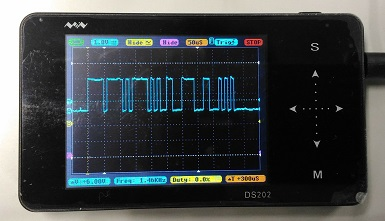
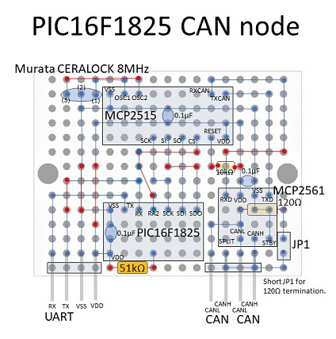

# CAN adapter to UART



## Motivation

I want to connect PIC-MCU-based sensor/actuator blocks to home/office controller(RasPi or OpenWrt) over CAN, since CAN is very cheap and supports daisy-chain network topology.

## Current status and plan

### Research

I decided to use cheap PIC 8bit MCU and FTDI with MCP2515/MCP2561 in this project.

I have also evaluated ARM mbed with CAN (LPC1768/MCP2561), but ARM Cortex-M is not suitable for the goal: expensive and over spec. I will use [a cheap ARM mbed](http://akizukidenshi.com/catalog/g/gK-12144/) with [ENC28J60](http://akizukidenshi.com/catalog/g/gI-01948/) to develop CAN-MQTT gateway in another project.


SocketCAN and SLCAN are interesting, so I evaluated them. But SLCAN does not support mask/filtering on CAN controller, so I do not adopt them in this project.

### Version 0.1 (March 17, 2018)


- Purchased CAN adaptors from Amazon.
- Developed my original ASCII-based protocol over serial for MCP2515. The protocol is mainly for evaluating MCP2515.

### Version 0.2 plan

- Purchase three pairs of MCP2515 and MCP2561 in Akihabara.
- Develop my original CAN adaptor board.
- Develop CAN-MQTT gateway on RasPi and OpenWrt.
- Develop a 3D-printed DIN rail enclosure for the board by using [FreeCAD](https://www.freecadweb.org/).
- ~~Add [SLCAN](https://elixir.bootlin.com/linux/v3.4/source/drivers/net/can/slcan.c) that is ASCII-based protocol for SocketCAN.~~

### Version 0.3 plan

- Purchase [a cheap ARM mbed board](http://akizukidenshi.com/catalog/g/gK-12144/).
- Develop CAN-MQTT gateway on mbed.

### Version 0.4 plan

- Use KiCAD to redesign the circuit.

## CAN adaptor to UART

### With PC/Android(USB-OTG)

```
[PC or Android]-USB-[FTDI]-UART-[PIC16F1825]-SPI-[MCP2515]-[TJA1050]-- CAN bus

```
### With MCU (PIC, AVR or ARM Cortex-M)

```
[MCU]-UART-[PIC16F1825]-SPI-[MCP2515]-[TJA1050]-- CAN bus
```

### Use it as CAN library for PIC MCU

```
[PIC16F1XXX]-SPI-[MCP2515]-[TJA1050]-- CAN bus                   
```

## My original PIC16F1825 evaluation board


## Wiring with jumper cables


## Development environment

Microchip [MPLAB-X IDE](http://www.microchip.com/mplab/mplab-x-ide) with MCC plugin.

## Command (UART/USB)

```
/// UART2CAN HELP (version 0.11  March 19, 2018) ///
[Set standard identifier] @i<standard identifier>
[Set output mode] {debug: @vd, verbose: @vv, normal: @vn}
[Enable operation mode] {loopback: @ol, normal: @on}
     with SID: @ols or @ons, in hex format: @olh or @onh
[Set mask] @m<n><mask(SID10 ~ SID0)>
[Set filter] @f<n><filter(SID10 ~ SID0)>
[Set baud rate] @b<bpr>
[Abort all pending transmissions] @a
[Dump masks and filters] @F
[Dump registers] @d
[Send message] <message>
[Send message beginning with '@' character] @<@message>
[Receive message] <message> will be output
[Show this help]: @h
```

## Mask and filters

For example, to receive messages with SID 5, 10 and 15:
```
@m02047  --> RXM0 0b11111111111
@f05     --> RXF0 0b00000000101 (SID 5 message to RXB0)
@f110    --> RXF1 0b00000001010 (SID 10 message to RXB0)
@m12047  --> RXM1 0b11111111111
@f215    --> RXF2 0b00000001111 (SID 15 message to RXB1)
```

## Baud rate test on March 17th, 2018

```
Voltage: CANH - CANL
1bit: 16 Time Quantum (TQ)
```
### BPR2 (16TQ = 8 micro sec, 125kHz)


### BPR4 (16TQ = 16 micro sec, 62.5kHz)


### BPR8 (16TQ = 32 micro sec, 31.3kHz)


### BPR16 (16TQ = 64 micro sec, 15.6kHz)


### Logic analyzer

I have also got this cheap oscilloscope ["PCB scope"](http://www.picaxestore.com/en_gb/osc001.html) in [my original 3D-printed case](https://github.com/araobp/3D-printing/blob/master/osc001/osc001.stl):


The following is a screen shot from the oscilloscope in logic analyzer mode:


## 1st test on March 14th, 2018

(The problem below has already been fixed in ver 0.1 release)


It seemed like I forgot to set CNF1, CNF2 and CNF3 to appropriate values to generate 125kbps baudrate.

Assuming that the oscillator runs at 8MHz and BRP(Buad Rate Prescaller) = 2,

```
TQ = 2*2/8MHz = 500ns  ... Equation 5-2 in P38
16TQ corresponds to 125kHz

According to 5.3 in P 41,
SyncSeg = 1 TQ,
PropSeg = 2 TQ,
PS1 = 7TQ,
PS2 = 6TQ.

Total 16TQ.

CNF1 in P42
SJW: 01
BRP: 000001

CNF2
BTLMODE: 1
SAM: 1
PHSEG1: 110
PRSEG: 001

CNF3
SOF: 0
WAKFIL: 0
PHSEG2: 101
```

So the values of CNF1, CNF2 and CNF3 would be like this:

|Register | Value  |
|---------|--------|
|CNF1(2Ah)|01000001|
|CNF2(29h)|11110001|
|CNF3(28h)|00000101|

## CAN adaptor board

At first, I am going to use [this universal board](http://akizukidenshi.com/catalog/g/gP-08241/) to make a prototype of the CAN adaptor:



I have finished the first prototype (Marth 25, 2018):


After that, I am going to try [KiCAD](http://kicad-pcb.org/) to make my original board.

## Reference

### Datasheet (Microchip/NXP/Murata)

#### Microchip
- [PIC16F1825](http://ww1.microchip.com/downloads/en/DeviceDoc/41440A.pdf)
- [MCP2515](http://ww1.microchip.com/downloads/en/DeviceDoc/21801d.pdf)
- [MCP2561](http://ww1.microchip.com/downloads/en/DeviceDoc/20005167C.pdf)
- [MCP2515DM-BM](http://www.microchip.com/Developmenttools/ProductDetails.aspx?PartNO=MCP2515DM-BM)

#### NXP
- [TJA1050](https://www.nxp.com/docs/en/data-sheet/TJA1050.pdf)

#### Murata
- [Ceralock](https://www.murata.com/~/media/webrenewal/support/library/catalog/products/timingdevice/ceralock/p17e.ashx)
