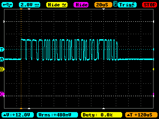

# CAN evaluation

## Research

I decided to use cheap PIC 8bit MCU and FTDI with MCP2515/MCP2561 in this project.

I have also evaluated ARM mbed with CAN (LPC1768/MCP2561), but ARM Cortex-M is not suitable for the goal: expensive and over spec. I will use [a cheap ARM mbed](http://akizukidenshi.com/catalog/g/gK-12144/) with [ENC28J60](http://akizukidenshi.com/catalog/g/gI-01948/) to develop CAN-MQTT gateway in another project.


SocketCAN and SLCAN are interesting, so I evaluated them. But SLCAN does not support mask/filtering on CAN controller, so I do not adopt them in this project.

## My original PIC16F1825 evaluation board

I use this PIC board to evaluate CAN:


## Wiring with jumper cables


## 1st test on March 14th, 2018

(The problem below has already been fixed in ver 0.1 release)




It seemed like I forgot to set CNF1, CNF2 and CNF3 to appropriate values to generate 125kbps baudrate.

Assuming that the oscillator runs at 8MHz and BRP(Buad Rate Prescaller) = 2,

```
TQ = 2*2/8MHz = 500ns  ... Equation 5-2 in P38
16TQ corresponds to 125kHz

According to 5.3 in P 41,
SyncSeg = 1 TQ,
PropSeg = 2 TQ,
PS1 = 7TQ,
PS2 = 6TQ.

Total 16TQ.

CNF1 in P42
SJW: 01
BRP: 000001

CNF2
BTLMODE: 1
SAM: 1
PHSEG1: 110
PRSEG: 001

CNF3
SOF: 0
WAKFIL: 0
PHSEG2: 101
```

So the values of CNF1, CNF2 and CNF3 would be like this:

|Register | Value  |
|---------|--------|
|CNF1(2Ah)|01000001|
|CNF2(29h)|11110001|
|CNF3(28h)|00000101|

## Baud rate test on March 17th, 2018

```
Voltage: CANH - CANL
1bit: 16 Time Quantum (TQ)
```
### BPR2 (16TQ = 8 micro sec, 125kHz)


### BPR4 (16TQ = 16 micro sec, 62.5kHz)


### BPR8 (16TQ = 32 micro sec, 31.3kHz)


### BPR16 (16TQ = 64 micro sec, 15.6kHz)


### Logic analyzer

I have also got this cheap oscilloscope ["PCB scope"](http://www.picaxestore.com/en_gb/osc001.html) in [my original 3D-printed case](https://github.com/araobp/3D-printing/blob/master/osc001/osc001.stl):


The following is a screen shot from the oscilloscope in logic analyzer mode:


